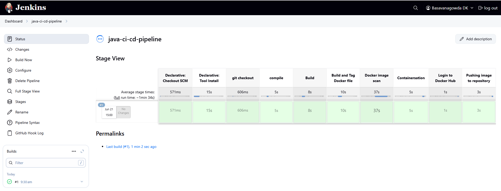
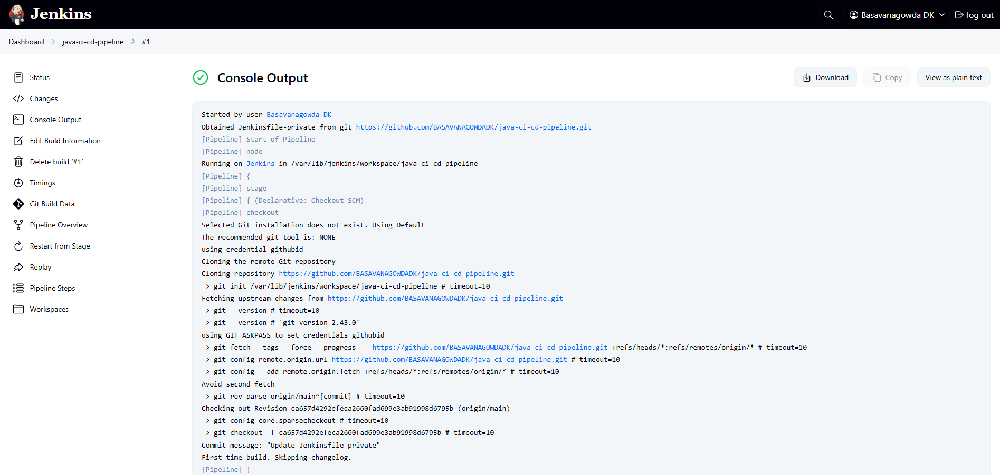
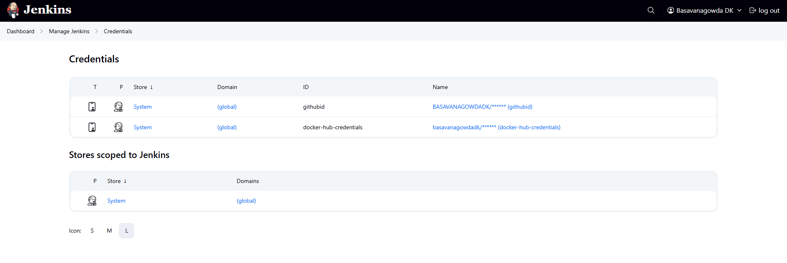
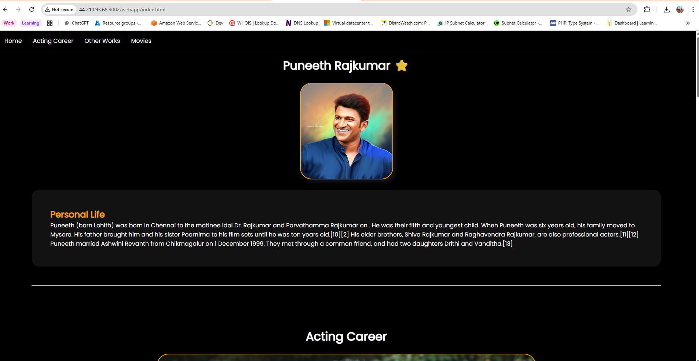

# Java CI/CD Pipeline with Jenkins, Docker, and GitHub

> ⚡ **End-to-End DevOps Project** | AWS EC2 | Jenkins + Docker + Trivy + DockerHub  
>
> This project showcases my ability to build a fully automated CI/CD pipeline from scratch — including provisioning, building, scanning, containerizing, and deploying a Java application using modern DevOps tools.

---

## 🧰 Tools Used
- Jenkins (Pipeline automation)
- Maven (Build tool)
- Docker (Containerization)
- Trivy (Security scanning)
- GitHub (Source code repo)
- DockerHub (Image registry)
- AWS EC2 (Deployment server)

---

## 📂 Repository Structure

```
.
├── #1.txt                          <-- Jenkins Build Console Log
├── Dockerfile                      <-- Docker instructions
├── Dockertagupdate.sh              <-- Script to update Docker tag
├── Jenkinsfile-private             <-- Jenkins pipeline script
├── README.md                       <-- Project documentation
├── ec2-setup.sh                    <-- EC2 provisioning script
├── pom.xml                         <-- Maven project descriptor (root)
├── screenshots/                    <-- Images for README
│   ├── cred.png
│   ├── docker repo.png
│   ├── logs.png
│   ├── page.png
│   └── stages.png
├── server/                         <-- Backend source code (Maven module)
├── webapp/                         <-- Web frontend module
.
```

---

## 🪄 Pipeline Overview

1. **SCM Checkout** – Clones code from GitHub
2. **Tool Setup** – Sets up Java 11 and Maven
3. **Build** – Compiles & packages Java project using Maven
4. **Docker Build** – Builds image from Dockerfile
5. **Security Scan** – Trivy image scan
6. **Deployment** – Runs container on EC2 and exposes app on port 9002
7. **Push to DockerHub** – Uses Jenkins credentials to publish image

---

## 📸 Screenshots

### 1. Jenkins Pipeline View


### 2. Jenkins Console Output


### 3. Jenkins Credentials Setup


### 4. DockerHub Repository


### 5. Web Application Running


---

## 📜 Logs as Proof

Console output from Jenkins pipeline execution is saved in [`#1.txt`](https://github.com/BASAVANAGOWDADK/java-ci-cd-pipeline/blob/main/%231.txt).

---

## 📦 DockerHub Link

[basavanagowdadk/java-ci-cd-pipeline](https://hub.docker.com/repository/docker/basavanagowdadk/java-ci-cd-pipeline/general)

---

## 🖥️ EC2 VM Setup Script (Used in User Data)

This script was run at the time of EC2 VM creation to automate installation of:
- Java
- Git
- Jenkins
- Docker
- Trivy

📄 **Script File**: [`ec2-setup.sh`](./ec2-setup.sh)

---

## 🎯 Why This Project Matters

- ✅ Simulates a **real-world DevOps pipeline** used in startups and enterprises
- 🔄 Full CI/CD workflow with Jenkins, Maven, Docker, and GitHub
- 🛡️ Integrated security with **Trivy** image scans
- ☁️ Built using infrastructure-as-code on **AWS EC2**
- 📦 Dockerized and pushed to **DockerHub**, then deployed live

---

## 👋 Looking for DevOps or Cloud Roles

I'm actively seeking DevOps Engineer or Cloud Developer opportunities.  
If you're hiring or know someone who is, feel free to connect with me:

- 📧 Email: basavanagowdadk@gmail.com  
- 🔗 [LinkedIn](https://www.linkedin.com/in/basavanagowda-d-k-b6b56a1a2)
  
Let's build something amazing together!

---

## 📃 License

MIT License
